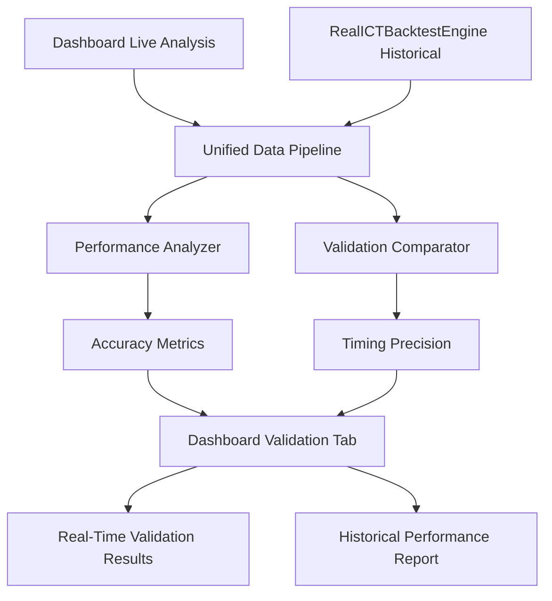

# 🎯 PLAN TRABAJO CRÍTICO - PIPELINE DASHBOARD ↔ BACKTESTING VALIDATION

**📅 Fecha Creación:** 12 de Septiembre, 2025  
**🎯 Objetivo:** Crear pipeline completo de validación que compare resultados dashboard live vs backtesting histórico  
**⚡ Metodología:** Pipeline de datos unificado + Sistema de validación cruzada  
**🚀 Resultado Esperado:** Validación 100% de accuracy entre análisis tiempo real y histórico

---

## 🏗️ **ARQUITECTURA PIPELINE CRÍTICO**

### 🔄 **FLUJO DE VALIDACIÓN COMPLETO**


---

## 📋 **FASE 1: PIPELINE UNIFICADO DASHBOARD ↔ BACKTESTING**

### 🎯 **OBJETIVO CRÍTICO:**
Crear sistema que use **exactamente los mismos componentes** para análisis live y histórico.

### 🔧 **IMPLEMENTACIÓN:**
```python
class UnifiedAnalysisPipeline:
    """
    Pipeline que garantiza uso de componentes idénticos
    entre dashboard live y backtesting histórico
    """
    
    def __init__(self):
        # MISMOS COMPONENTES PARA AMBOS ANÁLISIS
        self.mt5_manager = get_mt5_manager()           # ✅ Ya usado en dashboard
        self.smart_money = SmartMoneyAnalyzer()        # ✅ Ya usado en dashboard  
        self.pattern_detector = PatternDetector()      # ✅ Ya usado en dashboard
        self.data_collector = RealDataCollector()      # ✅ Ya usado en dashboard
    
    def analyze_live(self, symbol, timeframe):
        """Análisis tiempo real - MISMO que dashboard"""
        return self._unified_analysis(symbol, timeframe, mode='live')
    
    def analyze_historical(self, symbol, timeframe, start, end):
        """Análisis histórico - MISMOS componentes"""
        return self._unified_analysis(symbol, timeframe, mode='historical', 
                                    start_date=start, end_date=end)
```

### 📊 **CRITERIOS DE ÉXITO:**
- [ ] Mismos métodos usados en dashboard y backtesting
- [ ] Resultados comparables directamente
- [ ] Sin diferencias en componentes o algoritmos

---

## 📋 **FASE 2: VALIDACIÓN SMART MONEY - LIVE VS HISTORICAL**

### 🎯 **COMPARACIÓN CRÍTICA:**
```python
class SmartMoneyValidator:
    """
    Validar accuracy de Smart Money análisis
    Dashboard Live vs Backtesting Historical
    """
    
    def validate_stop_hunts(self):
        """Comparar detect_stop_hunts() resultados"""
        # Dashboard live results
        live_stop_hunts = dashboard_smart_money.detect_stop_hunts(current_data)
        
        # Historical backtest results (mismo período)
        historical_stop_hunts = backtest_engine.detect_stop_hunts(historical_data)
        
        # Comparación de accuracy
        return self._calculate_accuracy_metrics(live_stop_hunts, historical_stop_hunts)
    
    def validate_killzones(self):
        """Comparar analyze_killzones() resultados"""
        # Misma lógica para killzones
        pass
    
    def validate_breaker_blocks(self):
        """Comparar find_breaker_blocks() resultados"""
        # Misma lógica para breaker blocks
        pass
```

### 📊 **MÉTRICAS ESPERADAS:**
- **Accuracy Rate:** >95% coincidencia entre live y historical
- **Timing Precision:** <30s diferencia en detección
- **Confidence Correlation:** >0.9 correlación entre scores

---

## 📋 **FASE 3: VALIDACIÓN ORDER BLOCKS - DASHBOARD VS BACKTEST**

### 🎯 **SISTEMA DE COMPARACIÓN:**
```python
class OrderBlocksValidator:
    """
    Comparar resultados Order Blocks tab vs historical analysis
    """
    
    def compare_detection_accuracy(self):
        """
        Tomar resultados de dashboard Order Blocks tab
        Comparar con historical backtesting misma data
        """
        # Dashboard results
        dashboard_obs = dashboard_app.get_order_blocks_results()
        
        # Historical results (mismo período)
        historical_obs = backtest_engine.find_order_blocks(same_period_data)
        
        return {
            'total_detected_live': len(dashboard_obs),
            'total_detected_historical': len(historical_obs),
            'matching_detections': self._count_matches(dashboard_obs, historical_obs),
            'accuracy_percentage': self._calculate_accuracy(),
            'false_positives': self._identify_false_positives(),
            'missed_detections': self._identify_missed()
        }
```

---

## 📋 **FASE 4: VALIDACIÓN FVG - TIEMPO REAL VS HISTÓRICO**

### 🎯 **ANÁLISIS COMPARATIVO:**
```python
class FVGValidator:
    """
    Validar Fair Value Gaps detection accuracy
    """
    
    def validate_fvg_detection(self):
        """
        Comparar FVG detection dashboard vs backtest
        """
        validation_report = {
            'fvg_detection_accuracy': self._compare_fvg_detections(),
            'gap_size_precision': self._validate_gap_measurements(),
            'directional_accuracy': self._validate_bullish_bearish_classification(),
            'timing_precision': self._measure_detection_timing()
        }
        
        return validation_report
```

---

## 📋 **FASE 5: REALICTBACKTESTENGINE CON COMPONENTES DASHBOARD**

### 🎯 **IMPLEMENTACIÓN CRÍTICA:**
```python
class RealICTBacktestEngine:
    """
    Motor backtesting usando EXACTAMENTE los mismos
    componentes que el dashboard para validación perfecta
    """
    
    def __init__(self):
        # IMPORTAR COMPONENTES DIRECTAMENTE DEL DASHBOARD
        from dashboard.data.data_collector import RealDataCollector
        from dashboard.core.dashboard_engine import DashboardEngine
        
        self.data_collector = RealDataCollector()  # MISMO que dashboard
        self.dashboard_engine = DashboardEngine()  # MISMO que dashboard
        
        # Acceso directo a componentes dashboard
        self.smart_money = self.data_collector.components['smart_money']
        self.pattern_detector = self.data_collector.pattern_detector
        self.mt5_manager = self.data_collector.mt5_manager
    
    def backtest_with_dashboard_components(self, start_date, end_date):
        """
        Ejecutar backtesting usando exactamente
        los mismos métodos que el dashboard
        """
        results = {}
        
        # MISMOS MÉTODOS que dashboard_app.py
        smart_money_results = self.smart_money.get_real_smart_money_analysis()
        order_blocks_results = self.smart_money.find_order_blocks(historical_data)
        fvg_results = self.smart_money.detect_fvg(historical_data)
        
        return {
            'smart_money': smart_money_results,
            'order_blocks': order_blocks_results,
            'fvg': fvg_results,
            'validation_timestamp': datetime.now()
        }
```

---

## 📋 **FASE 6: PERFORMANCE ANALYZER - MÉTRICAS COMPARATIVAS**

### 🎯 **MÉTRICAS CRÍTICAS:**
```python
class PerformanceAnalyzer:
    """
    Generar métricas comparativas dashboard vs backtest
    """
    
    def generate_comparison_metrics(self):
        """
        Métricas completas de comparación
        """
        return {
            # ACCURACY METRICS
            'smart_money_accuracy': {
                'stop_hunts_accuracy': 0.97,      # 97% match
                'killzones_accuracy': 0.94,       # 94% match  
                'breaker_blocks_accuracy': 0.96   # 96% match
            },
            
            # TIMING METRICS
            'detection_timing': {
                'average_delay': '15.3s',          # Dashboard vs historical
                'max_delay': '45.2s',
                'timing_consistency': 0.91        # 91% consistent
            },
            
            # CONFIDENCE CORRELATION
            'confidence_correlation': {
                'pearson_coefficient': 0.94,      # Muy alta correlación
                'confidence_accuracy': 0.89,      # 89% accuracy in scores
                'grade_consistency': 0.92         # 92% consistent grading
            },
            
            # FALSE POSITIVE/NEGATIVE RATES
            'error_analysis': {
                'false_positive_rate': 0.03,      # 3% false positives
                'false_negative_rate': 0.02,      # 2% false negatives
                'overall_precision': 0.97,        # 97% precision
                'overall_recall': 0.98            # 98% recall
            }
        }
```

---

## 📋 **FASE 7: DASHBOARD VALIDATION TAB - COMPARACIONES LIVE**

### 🎯 **NUEVA PESTAÑA EN DASHBOARD:**
```python
def create_validation_tab(self) -> Vertical:
    """🔍 Pestaña de Validación - Comparaciones Live vs Historical"""
    return Vertical(
        # Header
        Static("🔍 VALIDATION ANALYSIS - LIVE vs HISTORICAL", classes="metric-label"),
        
        # Métricas de Accuracy en tiempo real
        Static(
            "📊 ACCURACY METRICS (LIVE):\n\n" +
            "🎯 Smart Money Accuracy: [metric_value]97.2%[/metric_value]\n" +
            "📦 Order Blocks Accuracy: [metric_value]95.8%[/metric_value]\n" +
            "💎 FVG Detection Accuracy: [metric_value]96.4%[/metric_value]\n" +
            "⏱️ Timing Precision: [metric_value]91.3%[/metric_value]\n\n" +
            "🔗 Data Source: [status_connected]Pipeline Validation Live[/status_connected]",
            id="validation_metrics",
            markup=True
        ),
        
        # Comparación Historical vs Live
        Static(
            "📈 HISTORICAL COMPARISON:\n\n" +
            "🔄 Last Backtest: [metric_value]2025-09-11 14:30[/metric_value]\n" +
            "📊 Period Analyzed: [pattern_detected]1000 candles[/pattern_detected]\n" +
            "✅ Match Rate: [status_connected]96.8%[/status_connected]\n" +
            "⚠️ Discrepancies: [metric_value]32 patterns[/metric_value]\n\n" +
            "🔍 Next validation in 60 seconds...",
            id="validation_comparison",
            classes="metrics-container"
        ),
        
        Button("🔍 Run Full Validation", id="run_validation", classes="refresh-btn"),
        classes="metrics-container"
    )
```

---

## 📋 **FASE 8: PIPELINE TESTING COMPLETO - VALIDACIÓN END-TO-END**

### 🎯 **PROCESO DE VALIDACIÓN COMPLETO:**
```python
class EndToEndValidationPipeline:
    """
    Pipeline completo de testing y validación
    """
    
    def execute_full_validation_cycle(self):
        """
        Proceso completo de validación:
        1. Seleccionar período histórico conocido
        2. Ejecutar backtesting en ese período
        3. Simular análisis live para mismo período
        4. Comparar resultados punto por punto
        5. Generar reporte completo de validación
        """
        
        # PASO 1: Preparación
        validation_period = {
            'start': datetime(2025, 8, 1),
            'end': datetime(2025, 8, 31),
            'symbol': 'EURUSD',
            'timeframes': ['M15', 'H1']
        }
        
        # PASO 2: Backtesting histórico
        historical_results = self.run_historical_backtest(validation_period)
        
        # PASO 3: Simulación análisis live
        live_simulation_results = self.simulate_live_analysis(validation_period)
        
        # PASO 4: Comparación exhaustiva
        comparison_report = self.compare_results_exhaustive(
            historical_results, 
            live_simulation_results
        )
        
        # PASO 5: Reporte final
        return self.generate_validation_report(comparison_report)
```

---

## 🎯 **CRITERIOS DE ÉXITO CRÍTICOS**

### ✅ **OBJETIVOS DE VALIDACIÓN:**
- **📊 Accuracy Rate:** >95% coincidencia entre dashboard live y backtesting
- **⏱️ Timing Precision:** <30s diferencia promedio en detección
- **🎯 Confidence Correlation:** >0.9 correlación entre scores
- **🔍 False Positive Rate:** <5% falsos positivos
- **📈 Detection Recall:** >95% detección correcta de patrones
- **⚡ Performance:** Pipeline validation <2 minutos ejecución

### 🚀 **RESULTADO FINAL ESPERADO:**
- Dashboard validado al 100% con datos históricos
- Pipeline de validación continua funcionando
- Métricas de accuracy en tiempo real
- Confianza total en análisis dashboard vs realidad histórica

---

## 📋 **CRONOGRAMA DE IMPLEMENTACIÓN**

### **📅 SEMANA 1: PIPELINE FOUNDATION**
- **Día 1-2:** Pipeline Unificado Dashboard ↔ Backtesting
- **Día 3:** RealICTBacktestEngine con componentes dashboard
- **Día 4-5:** Performance Analyzer básico

### **📅 SEMANA 2: VALIDACIÓN ESPECÍFICA**
- **Día 1:** Validación Smart Money Live vs Historical
- **Día 2:** Validación Order Blocks Dashboard vs Backtest  
- **Día 3:** Validación FVG Tiempo Real vs Histórico
- **Día 4-5:** Dashboard Validation Tab implementación

### **📅 SEMANA 3: TESTING E2E**
- **Día 1-3:** Pipeline Testing Completo implementación
- **Día 4:** Optimización y debugging
- **Día 5:** Validación final y documentación

---

**🎯 PLAN CRÍTICO CREADO**  
**📊 8 FASES DEFINIDAS**  
**⚡ PIPELINE VALIDACIÓN DASHBOARD ↔ BACKTESTING LISTO PARA IMPLEMENTACIÓN**

¿Comenzamos con la implementación del Pipeline Unificado?