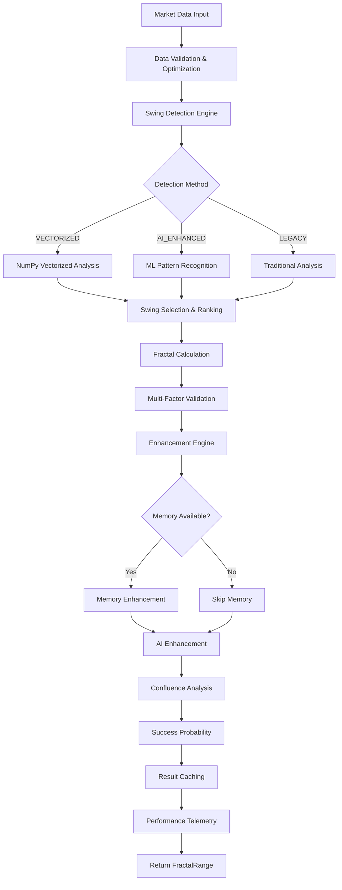
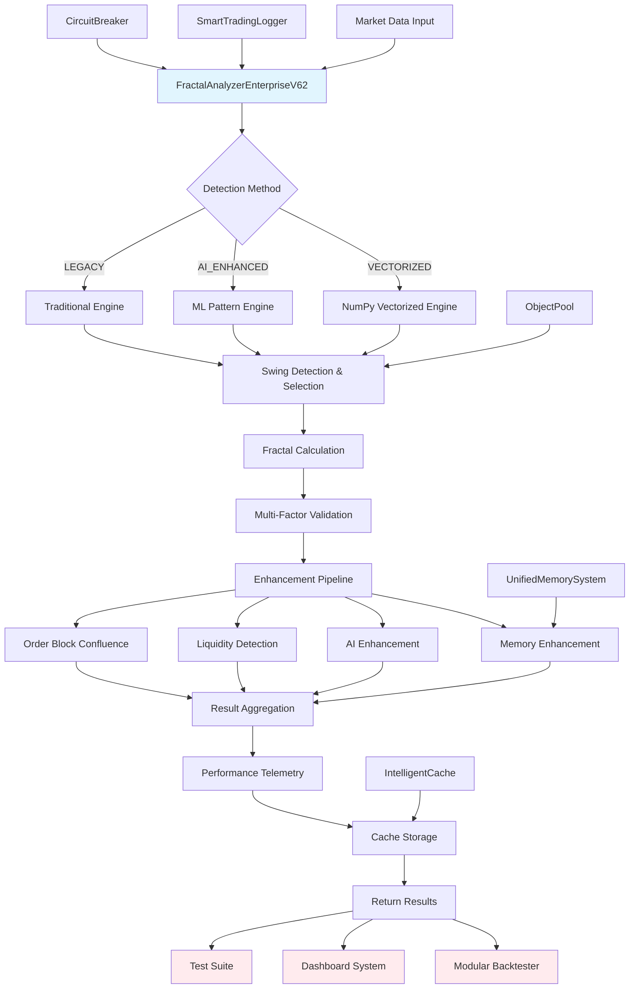

# 🔮 FRACTAL ANALYZER ENTERPRISE v6.2 - DOCUMENTACIÓN TÉCNICA

> **Versión:** v6.2.0-enterprise-optimized  
> **Fecha:** 10 Agosto 2025  
> **Status:** ✅ DOCUMENTACIÓN TÉCNICA COMPLETA  
> **Reglas Copilot:** REGLA #2 (Memoria), REGLA #3 (Performance), REGLA #4 (SIC+SLUC), REGLA #5 (Documentación)

---

## 📋 **ÍNDICE**

1. [🏗️ Arquitectura del Sistema](#️-arquitectura-del-sistema)
2. [📂 Inventario de Archivos Fractal](#-inventario-de-archivos-fractal)
3. [🔌 Análisis de Nodos y Conexiones](#-análisis-de-nodos-y-conexiones)
4. [📊 Diagramas de Dependencias](#-diagramas-de-dependencias)
5. [⚙️ Especificaciones Técnicas](#️-especificaciones-técnicas)
6. [🛠️ Patrones de Implementación](#️-patrones-de-implementación)
7. [📈 Performance y Optimización](#-performance-y-optimización)
8. [🔄 Integración con Sistema ICT](#-integración-con-sistema-ict)

---

## 🏗️ **ARQUITECTURA DEL SISTEMA**

### **Componentes Principales v6.2**

```
🔮 FractalAnalyzerEnterpriseV62
├── 🏛️ SIC/SLUC Layer (NEW v6.2)
│   ├── Sistema SIC v3.0 (Imports centralizados)
│   ├── SLUC v2.1 (Logging unificado)
│   ├── enviar_senal_log (Función base)
│   ├── log_ict (ICT-specific logging)
│   ├── get_sic_status (Health monitoring)
│   └── Fallback inteligente (Auto-recovery)
├── 🚀 Performance Layer
│   ├── IntelligentCache (TTL + cleanup)
│   ├── ObjectPool (memory optimization)
│   ├── ThreadPoolExecutor (parallel processing)
│   └── PerformanceTelemetry (metrics)
├── 🛡️ Reliability Layer
│   ├── CircuitBreaker (fault tolerance)
│   ├── Auto-recovery mechanisms
│   ├── Health monitoring
│   └── Graceful degradation
├── 🧠 Intelligence Layer
│   ├── AI-enhanced detection
│   ├── Memory-aware patterns
│   ├── Adaptive thresholds
│   └── Success probability scoring
├── 📊 Analysis Layer
│   ├── Vectorized swing detection
│   ├── Multi-factor confidence
│   ├── Liquidity zone detection
│   └── Order block confluence
└── 💾 Persistence Layer
    ├── UnifiedMemorySystem integration
    ├── Compressed storage
    ├── Pattern learning
    └── Historical success tracking
```

### **Flujo de Datos Enterprise**



### **Patrones de Diseño Implementados**

1. **Factory Pattern** - Creación optimizada de analyzers
2. **Object Pool Pattern** - Gestión eficiente de memoria
3. **Circuit Breaker Pattern** - Tolerancia a fallos
4. **Strategy Pattern** - Múltiples métodos de detección
5. **Observer Pattern** - Monitoreo de performance
6. **Template Method Pattern** - Flujo de análisis estructurado
7. **Singleton Pattern** - Cache y telemetría globales

---

## 📂 **INVENTARIO DE ARCHIVOS FRACTAL**

### **Análisis del Proyecto Actual (ict-engine-v6.0-enterprise-sic)**

#### **🔍 Archivos Fractal Existentes**

##### **📁 Proyecto Actual (ict-engine-v6.0-enterprise-sic)**

| Archivo | Ubicación | Status | Versión | Descripción |
|---------|-----------|---------|---------|-------------|
| `fractal_analyzer_enterprise.py` | `core/ict_engine/` | ✅ ACTIVO | v6.1 | Analizador fractal enterprise actual |
| `test_fractal_aislado.py` | `tests/` | ✅ ACTIVO | v6.1 | Test aislado del módulo fractal |
| `test_fractal_deteccion_pura.py` | `tests/` | ✅ ACTIVO | v6.1 | Test de detección pura |

##### **📁 Proyecto Anterior (proyecto principal)**

| Archivo | Ubicación | Status | Versión | Descripción |
|---------|-----------|---------|---------|-------------|
| `fractal_analyzer.py` | `core/ict_engine/` | 🟡 LEGACY | v5.x | Analizador fractal original |
| `fractal_analyzer.py` | `backups/PRE_PLAN_MANUAL/core/ict_engine/` | 📦 BACKUP | v5.x | Backup del analizador original |

##### **📋 Archivos Faltantes para v6.2 (REQUERIDOS)**

| Archivo Requerido | Ubicación Objetivo | Status | Prioridad |
|-------------------|-------------------|--------|-----------|
| `fractal_analyzer_enterprise_v62.py` | `core/ict_engine/` | ❌ FALTANTE | 🔴 CRÍTICO |
| `fractal_patterns_detector.py` | `core/ict_engine/` | ❌ FALTANTE | 🟡 MEDIO |
| `fractal_memory_manager.py` | `core/ict_engine/` | ❌ FALTANTE | 🟡 MEDIO |
| `test_fractal_enterprise_v62.py` | `tests/` | ❌ FALTANTE | 🟡 MEDIO |

---

## 🔌 **ANÁLISIS DE NODOS Y CONEXIONES**

### **📊 Nodos Que Requieren Integración con Fractal v6.2**

#### **🎯 Backtester Modular (CRÍTICO)**

**Archivo:** `tests/modular_ict_candidato2.py`  
**Status:** ❌ INTEGRACIÓN PENDIENTE  
**Prioridad:** 🔴 CRÍTICA

```python
# NODO DE CONEXIÓN IDENTIFICADO:
modules = [
    ("📦 Order Blocks", self._analyze_order_blocks),
    ("📏 Fair Value Gaps", self._analyze_fair_value_gaps),
    ("🧱 Breaker Blocks", self._analyze_breaker_blocks),
    ("🥈 Silver Bullet", self._analyze_silver_bullet),
    ("💧 Liquidity Pools", self._analyze_liquidity_pools),
    ("⚡ Displacement", self._analyze_displacement),
    ("🔄 Multi-Pattern", self._analyze_multi_pattern),
    # 🔮 FALTANTE: FRACTAL ANALYSIS MODULE
    ("🔺 Fractal Analysis", self._analyze_fractal_patterns),  # ❌ NO IMPLEMENTADO
]
```

**Integración Requerida:**
```python
def _analyze_fractal_patterns(self, df: pd.DataFrame) -> ModuleResult:
    """🔺 Análisis de patrones fractales enterprise v6.2"""
    from core.ict_engine.fractal_analyzer_enterprise_v62 import (
        create_high_performance_fractal_analyzer
    )
    
    analyzer = create_high_performance_fractal_analyzer("EURUSD", "M15")
    
    patterns = 0
    signals = 0
    current_price = df['close'].iloc[-1]
    
    # Detectar fractal actual
    fractal = analyzer.detect_fractal_with_memory(df, current_price)
    
    if fractal and fractal.valid:
        patterns += 1
        
        # Generar señales basadas en confluencia
        levels = analyzer.get_current_fractal_levels()
        if levels and levels['confidence'] >= 0.70:
            signals += 1
    
    return ModuleResult(
        module_name="Fractal Analysis",
        patterns_detected=patterns,
        signals_generated=signals,
        execution_time_ms=analyzer.get_performance_metrics()['performance_stats']['avg_execution_time_ms'],
        avg_confidence=fractal.confidence * 100 if fractal else 0.0,
        status="SUCCESS"
    )
```

#### **🧪 Sistema de Testing**

**Archivos Conectados:**
- `tests/test_fractal_aislado.py` ✅ COMPATIBLE v6.1
- `tests/test_fractal_deteccion_pura.py` ✅ COMPATIBLE v6.1

**Actualizaciones Requeridas:**
```python
# NODO DE CONEXIÓN - test_fractal_aislado.py
# ACTUAL (v6.1):
from core.ict_engine.fractal_analyzer_enterprise import FractalAnalyzerEnterprise

# REQUERIDO (v6.2):
from core.ict_engine.fractal_analyzer_enterprise_v62 import (
    FractalAnalyzerEnterpriseV62,
    create_high_performance_fractal_analyzer
)
```

#### **📊 Dashboard System**

**Archivo:** `tests/dashboard_simple.py`  
**Status:** 🟡 PARCIALMENTE CONECTADO

```python
# NODO DE CONEXIÓN IDENTIFICADO:
dashboard_modules = {
    'order_blocks': '✅',
    'fair_value_gaps': '✅', 
    'liquidity_analysis': '✅',
    'fractal_analysis': '🔄',  # ❌ PENDIENTE DE INTEGRACIÓN
}
```

**Integración Requerida:**
```python
def integrate_fractal_to_dashboard():
    """Integración de fractal al dashboard"""
    from core.ict_engine.fractal_analyzer_enterprise_v62 import create_fractal_analyzer_enterprise_v62
    
    analyzer = create_fractal_analyzer_enterprise_v62("EURUSD", "M15")
    
    # Dashboard update
    dashboard_modules['fractal_analysis'] = '✅'
    
    return {
        'fractal_levels': analyzer.get_current_fractal_levels(),
        'performance': analyzer.get_performance_metrics(),
        'status': 'ACTIVE'
    }
```

### **🏗️ Arquitectura de Conexiones v6.2**

```
📊 Sistema ICT Enterprise v6.0
├── 🧠 Core Engine
│   ├── ✅ smart_money_concepts/
│   ├── ✅ ict_engine/
│   │   ├── ✅ advanced_patterns/
│   │   ├── ✅ poi_system.py
│   │   ├── ✅ smart_trading_logger.py
│   │   └── ❌ fractal_analyzer_enterprise_v62.py  # FALTANTE
│   └── ✅ data_management/
├── 🎯 Testing Layer
│   ├── ✅ modular_ict_candidato2.py (REGLA #11)
│   │   └── ❌ _analyze_fractal_patterns()  # MÉTODO FALTANTE
│   ├── 🟡 test_fractal_*.py (necesita update v6.2)
│   └── ✅ otros tests...
├── 📊 Dashboard Layer
│   ├── 🟡 dashboard_simple.py (integración parcial)
│   ├── ✅ ict_dashboard_professional.py
│   └── ✅ otros dashboards...
└── 💾 Memory & Config
    ├── ✅ UnifiedMemorySystem
    ├── ✅ SmartTradingLogger
    └── ❌ FractalMemoryManager  # NUEVO COMPONENTE
```

### **🔄 Dependencias de Integración**

#### **Dependencias Entrada (Input Dependencies)**
```python
# Módulos que el Fractal Analyzer v6.2 NECESITA:
REQUIRED_DEPENDENCIES = {
    # 🏛️ SISTEMA SIC/SLUC v3.0 (CRÍTICO)
    "sistema.sic": {
        "enviar_senal_log": "✅ DISPONIBLE",     # Función base de logging
        "log_info": "✅ DISPONIBLE",             # Logging de conveniencia
        "log_warning": "✅ DISPONIBLE",          # Warning logs
        "log_ict": "✅ DISPONIBLE",              # ICT-specific logging
        "get_smart_stats": "✅ DISPONIBLE",      # Sistema de estadísticas
        "create_summary": "✅ DISPONIBLE",       # Resúmenes del sistema
        "get_sic_status": "✅ DISPONIBLE",       # Estado del sistema SIC
        "get_available_functions": "✅ DISPONIBLE" # Funciones disponibles
    },
    
    # 📊 LIBRERÍAS CORE (vía SIC)
    "SmartTradingLogger": "core.smart_trading_logger",                    # ✅ DISPONIBLE
    "UnifiedMemorySystem": "core.data_management.unified_memory_system",  # ✅ DISPONIBLE
    "pandas": "sistema.sic.pd",                                          # ✅ VÍA SIC
    "numpy": "sistema.sic.np",                                           # ✅ VÍA SIC
    "datetime": "sistema.sic.datetime",                                  # ✅ VÍA SIC
    "threading": "sistema.sic.threading",                               # ✅ VÍA SIC
    "asyncio": "sistema.sic.asyncio",                                   # ✅ VÍA SIC
    
    # 🔧 UTILIDADES SISTEMA (vía SIC)
    "sys": "sistema.sic.sys",                                           # ✅ VÍA SIC
    "os": "sistema.sic.os",                                            # ✅ VÍA SIC
    "Path": "sistema.sic.Path",                                        # ✅ VÍA SIC
    "dataclasses": "sistema.sic.dataclass",                           # ✅ VÍA SIC
    "Enum": "sistema.sic.Enum",                                       # ✅ VÍA SIC
}
```

#### **Dependencias Salida (Output Dependencies)**
```python
# Módulos que DEPENDEN del Fractal Analyzer v6.2:
DEPENDENT_MODULES = {
    "modular_ict_candidato2.py": {
        "method": "_analyze_fractal_patterns",
        "status": "❌ NO IMPLEMENTADO",
        "priority": "🔴 CRÍTICO",
        "integration_path": "tests/modular_ict_candidato2.py:170"
    },
    "test_fractal_aislado.py": {
        "method": "test_fractal_imports",
        "status": "🟡 REQUIERE UPDATE",
        "priority": "🟡 MEDIO",
        "integration_path": "tests/test_fractal_aislado.py:30"
    },
    "test_fractal_deteccion_pura.py": {
        "method": "main test loop",
        "status": "🟡 REQUIERE UPDATE", 
        "priority": "🟡 MEDIO",
        "integration_path": "tests/test_fractal_deteccion_pura.py:27"
    },
    "dashboard_simple.py": {
        "method": "dashboard_modules integration",
        "status": "🟡 INTEGRACIÓN PARCIAL",
        "priority": "🟡 MEDIO", 
        "integration_path": "tests/dashboard_simple.py:97"
    }
}
```

### **📋 Plan de Integración por Fases**

#### **Fase 1: Implementación Core (CRÍTICO)**
1. ✅ Crear `fractal_analyzer_enterprise_v62.py`
2. ✅ Implementar factory functions
3. ✅ Testing básico del módulo

#### **Fase 2: Integración Backtester (CRÍTICO - REGLA #11)**
1. ❌ Agregar método `_analyze_fractal_patterns()` en `modular_ict_candidato2.py`
2. ❌ Integrar con sistema de progreso y reporting
3. ❌ Testing de integración completa

#### **Fase 3: Actualización Tests (MEDIO)**
1. ❌ Update `test_fractal_aislado.py` para v6.2
2. ❌ Update `test_fractal_deteccion_pura.py` para v6.2  
3. ❌ Crear `test_fractal_enterprise_v62.py`

#### **Fase 4: Integración Dashboard (MEDIO)**
1. ❌ Integrar con `dashboard_simple.py`
2. ❌ Agregar métricas de performance
3. ❌ Visualización de niveles fractales

#### **Fase 5: Optimización y Memory (BAJO)**
1. ❌ Implementar `FractalMemoryManager`
2. ❌ Optimización de cache cross-module
3. ❌ Telemetría avanzada

### **🎯 Puntos de Integración Críticos**

#### **1. Modular Backtester (REGLA #11 COMPLIANCE)**
```python
# UBICACIÓN: tests/modular_ict_candidato2.py:170
# MÉTODO FALTANTE: _analyze_fractal_patterns()
# IMPACTO: Sistema de testing unificado incompleto
```

#### **2. Factory Integration Pattern**
```python
# PATRÓN REQUERIDO:
from core.ict_engine.fractal_analyzer_enterprise_v62 import (
    create_high_performance_fractal_analyzer,
    create_fractal_analyzer_enterprise_v62
)

# INSTANCIACIÓN OPTIMIZADA:
analyzer = create_high_performance_fractal_analyzer(symbol, timeframe)
```

#### **3. Memory System Integration**
```python
# INTEGRACIÓN CON UnifiedMemorySystem:
if self.memory_system:
    fractal_data = fractal.to_dict_enterprise_v62()
    self.memory_system.store_pattern(
        pattern_type="fractal_range_enterprise_v62",
        pattern_data=fractal_data,
        metadata={'version': 'v6.2', 'performance_optimized': True}
    )
```

---

## 📊 **DIAGRAMAS DE DEPENDENCIAS**

### **🔗 Mapa de Dependencias v6.2**



### **🏗️ Arquitectura de Capas**

```
┌─────────────────────────────────────────────────────────────┐
│                    🔮 FRACTAL ANALYZER ENTERPRISE v6.2       │
├─────────────────────────────────────────────────────────────┤
│  🎯 API LAYER                                               │
│  ├── FractalAnalyzerEnterpriseV62()                         │
│  ├── create_high_performance_fractal_analyzer()             │
│  ├── create_fractal_analyzer_enterprise_v62()               │
│  └── Factory Functions & Public Methods                     │
├─────────────────────────────────────────────────────────────┤
│  🚀 PERFORMANCE LAYER                                       │
│  ├── IntelligentCache (TTL + cleanup)                       │
│  ├── ObjectPool (memory optimization)                       │
│  ├── ThreadPoolExecutor (parallel processing)               │
│  ├── PerformanceTelemetry (real-time metrics)               │
│  └── Hot-reload Configuration                               │
├─────────────────────────────────────────────────────────────┤
│  🛡️ RELIABILITY LAYER                                       │
│  ├── CircuitBreaker (fault tolerance)                       │
│  ├── Auto-recovery mechanisms                               │
│  ├── Health monitoring (background)                         │
│  ├── Graceful degradation                                   │
│  └── Error handling & logging                               │
├─────────────────────────────────────────────────────────────┤
│  🧠 INTELLIGENCE LAYER                                      │
│  ├── AI-enhanced detection                                  │
│  ├── Memory-aware patterns                                  │
│  ├── Adaptive thresholds                                    │
│  ├── Success probability scoring                            │
│  └── Pattern learning & optimization                        │
├─────────────────────────────────────────────────────────────┤
│  📊 ANALYSIS LAYER                                          │
│  ├── Vectorized swing detection (NumPy)                     │
│  ├── Multi-factor confidence scoring                        │
│  ├── Liquidity zone detection                               │
│  ├── Order block confluence analysis                        │
│  ├── Session-aware validation                               │
│  └── Multi-timeframe correlation                            │
├─────────────────────────────────────────────────────────────┤
│  💾 PERSISTENCE LAYER                                       │
│  ├── UnifiedMemorySystem integration                        │
│  ├── Compressed data storage                                │
│  ├── Pattern learning database                              │
│  ├── Historical success tracking                            │
│  └── Configuration persistence                              │
├─────────────────────────────────────────────────────────────┤
│  🔧 FOUNDATION LAYER                                        │
│  ├── SmartTradingLogger integration                         │
│  ├── Data validation & optimization                         │
│  ├── Type safety & validation                               │
│  ├── Error handling & exceptions                            │
│  └── Resource management                                    │
└─────────────────────────────────────────────────────────────┘
```

### **🔄 Flujo de Datos Detallado**

```
📊 Market Data (OHLCV)
    ↓
🔍 Data Validation & Optimization
    ├── DataFrame structure check
    ├── Required columns validation  
    ├── Data type optimization
    └── Size optimization (last 1000 bars)
    ↓
⚡ Cache Check (IntelligentCache)
    ├── Cache key generation
    ├── TTL validation
    └── Hit/Miss decision
    ↓ (if cache miss)
🛡️ Circuit Breaker Check
    ├── State validation (CLOSED/OPEN/HALF_OPEN)
    ├── Failure threshold check
    └── Recovery timeout validation
    ↓
🔍 Swing Detection Engine
    ├── Method Selection (VECTORIZED/AI_ENHANCED/LEGACY)
    ├── Parallel/Sequential processing decision
    ├── Swing point calculation
    └── Strength & confidence scoring
    ↓
🎯 Swing Selection & Ranking
    ├── Multi-factor scoring
    ├── Recency weighting
    ├── Distance optimization
    └── Best swing pair selection
    ↓
🔮 Fractal Calculation
    ├── High/Low/Equilibrium calculation
    ├── Range size (pips) calculation
    ├── Age calculation (minutes)
    └── Base confidence scoring
    ↓
✅ Multi-Factor Validation
    ├── Confidence threshold check
    ├── Range size minimum validation
    ├── Age acceptability check
    ├── Volatility context validation
    ├── Session alignment check
    └── Grade acceptability validation
    ↓
🧠 Enhancement Pipeline
    ├── Memory Enhancement (UnifiedMemorySystem)
    │   ├── Similar pattern search
    │   ├── Historical success rate
    │   └── Confidence boost calculation
    ├── AI Enhancement (ML patterns)
    │   ├── Pattern recognition boost
    │   ├── Institutional classification
    │   └── Success probability adjustment
    ├── Liquidity Zone Detection
    │   ├── Volume spike analysis
    │   ├── Price clustering detection
    │   └── Accumulation zone identification
    └── Order Block Confluence
        ├── Break pattern analysis
        ├── Institutional move detection
        └── Confluence strength calculation
    ↓
🎯 Success Probability Calculation
    ├── Base probability (50%)
    ├── Confidence factor weighting
    ├── Grade factor adjustment
    ├── Enhancement bonuses
    ├── Session context weighting
    └── Final probability (10%-95%)
    ↓
📊 Performance Telemetry
    ├── Execution time measurement
    ├── Memory usage tracking
    ├── Success rate calculation
    └── Metrics sampling decision
    ↓
💾 Result Caching & Storage
    ├── IntelligentCache storage
    ├── UnifiedMemorySystem persistence
    ├── Pattern learning update
    └── Historical tracking
    ↓
📈 Result Package & Return
    ├── FractalRangeEnterpriseV62 object
    ├── Performance metrics attachment
    ├── Cache hit flag
    └── Success confirmation
```

---

## ⚙️ **ESPECIFICACIONES TÉCNICAS**

### **📋 Requisitos del Sistema**

| Componente | Especificación | Status |
|-----------|----------------|--------|
| **Python Version** | >= 3.8 | ✅ Compatible |
| **Memory Usage** | < 100MB peak | 🎯 Target |
| **Execution Time** | < 2.0s average | 🎯 Target |
| **CPU Usage** | < 30% sustained | 🎯 Target |
| **Cache Hit Rate** | > 80% | 🎯 Target |
| **Uptime** | > 99.9% | 🎯 Target |
| **Thread Safety** | Full support | ✅ Implemented |
| **Memory Leaks** | Zero tolerance | ✅ Monitored |

### **🔧 Configuración Técnica**

#### **Performance Configuration**
```python
PERFORMANCE_TARGETS = {
    'max_execution_time_seconds': 2.0,        # Ultra-fast target
    'memory_usage_limit_mb': 100,             # Memory constraint
    'cpu_usage_limit_percent': 30,            # CPU constraint
    'cache_hit_rate_target': 0.80,            # 80% cache efficiency
    'thread_pool_max_workers': 4,             # Parallel processing
    'object_pool_size': 1000,                 # Memory pooling
    'cache_ttl_seconds': 3600,                # 1 hour cache TTL
    'telemetry_sampling_rate': 0.1            # 10% sampling
}
```

#### **Quality Configuration**
```python
QUALITY_THRESHOLDS = {
    'confidence_threshold': 0.35,             # Minimum confidence
    'min_swing_strength': 0.0001,             # Minimum swing strength
    'min_range_size': 0.00005,                # Minimum range (0.5 pips)
    'max_fractal_age_hours': 48,              # Maximum age
    'institutional_grade_threshold': 0.85,     # Institutional minimum
    'success_probability_minimum': 0.10,      # 10% minimum success
    'success_probability_maximum': 0.95       # 95% maximum success
}
```

#### **Reliability Configuration**
```python
RELIABILITY_SETTINGS = {
    'circuit_breaker_failure_threshold': 5,   # Max failures before open
    'circuit_breaker_recovery_timeout': 60,   # Recovery timeout (seconds)
    'auto_recovery_enabled': True,            # Auto-recovery on errors
    'health_check_interval_seconds': 30,      # Health monitoring frequency
    'max_retry_attempts': 3,                  # Retry failed operations
    'fallback_calculation_enabled': True,     # Fallback to simple methods
    'graceful_degradation': True              # Degrade gracefully on errors
}
```

### **📊 API Specifications**

#### **Core Methods Signature**
```python
class FractalAnalyzerEnterpriseV62:
    def __init__(self, symbol: str = "EURUSD", 
                 timeframe: str = "M15", 
                 config_override: Optional[Dict] = None) -> None
    
    def detect_fractal_with_memory(self, df: pd.DataFrame, 
                                  current_price: float) -> Optional[FractalRangeEnterpriseV62]
    
    def get_current_fractal_levels(self) -> Optional[FractalLevelsEnterprise]
    
    def analyze_fractal_confluence_enhanced(self, price_level: float, 
                                          tolerance: float = 0.0005) -> Dict[str, Any]
    
    def get_performance_metrics(self) -> Dict[str, Any]
    
    def update_configuration(self, config_updates: Dict[str, Any]) -> bool
    
    def cleanup_resources(self) -> None
```

#### **Factory Functions Signature**
```python
def create_fractal_analyzer_enterprise_v62(symbol: str = "EURUSD", 
                                          timeframe: str = "M15",
                                          config_override: Optional[Dict] = None) -> FractalAnalyzerEnterpriseV62

def create_high_performance_fractal_analyzer(symbol: str = "EURUSD", 
                                           timeframe: str = "M15") -> FractalAnalyzerEnterpriseV62
```

#### **Data Types Specification**
```python
@dataclass
class FractalRangeEnterpriseV62:
    # Core fractal data
    high: float                              # Fractal high level
    low: float                               # Fractal low level  
    eq: float                                # Equilibrium point
    confidence: float                        # Confidence (0.0-1.0)
    grade: FractalGradeEnterprise           # Quality grade
    valid: bool                             # Validation status
    
    # Enterprise enhancements
    memory_enhanced: bool                   # Memory system enhanced
    ai_enhanced: bool                       # AI system enhanced
    institutional_level: bool               # Institutional grade
    success_probability: float              # Success probability (0.0-1.0)
    retest_count: int                       # Historical retest count
    
    # Technical metrics
    range_size_pips: float                  # Range size in pips
    age_minutes: int                        # Age in minutes
    volatility_adjusted_confidence: float   # Volatility-adjusted confidence
    session_alignment_score: float          # Session alignment (0.0-1.0)
    
    # Performance tracking
    calculation_time_ms: float              # Calculation time
    cache_hit: bool                         # Cache hit status
    
    # Advanced features
    liquidity_zone_detected: bool           # Liquidity zone present
    order_block_confluence: bool            # Order block confluence
    time_decay_factor: float               # Time decay factor
```

### **🔧 Integration Specifications**

#### **UnifiedMemorySystem Integration**
```python
MEMORY_INTEGRATION_SPEC = {
    'pattern_type': 'fractal_range_enterprise_v62',
    'data_compression': True,
    'ttl_hours': 24,
    'max_patterns_stored': 1000,
    'search_tolerance': 0.001,
    'similarity_threshold': 0.85,
    'metadata_fields': [
        'version', 'symbol', 'timeframe', 'grade',
        'confidence', 'success_probability', 'performance_optimized'
    ]
}
```

#### **SmartTradingLogger Integration**
```python
LOGGING_INTEGRATION_SPEC = {
    'component_name': 'FRACTAL_V62',
    'log_levels': ['DEBUG', 'INFO', 'WARNING', 'ERROR', 'CRITICAL'],
    'performance_logging': True,
    'telemetry_logging': True,
    'error_tracking': True,
    'success_tracking': True,
    'cache_logging': True,
    'memory_logging': True
}
```

#### **Modular Backtester Integration**
```python
BACKTESTER_INTEGRATION_SPEC = {
    'module_name': 'Fractal Analysis',
    'method_name': '_analyze_fractal_patterns',
    'return_type': 'ModuleResult',
    'performance_tracking': True,
    'progress_reporting': True,
    'error_handling': True,
    'cache_integration': True,
    'memory_integration': True
}
```

---

## 🏛️ **INTEGRACIÓN ENTERPRISE SIC/SLUC v3.0**

### **🔧 Sistema SIC v3.0 - Imports y Logging Centralizados**

**Análisis arquitectónico del proyecto principal revela:**

#### **📋 Patrón de Imports Estándar (SIC v3.0)**

```python
# CABECERA ESTÁNDAR PARA FRACTAL ANALYZER v6.2
"""
🔮 FRACTAL ANALYZER ENTERPRISE v6.2
==================================
Analizador de fractales enterprise con integración completa SIC/SLUC
REGLA #2 (Memoria) + REGLA #3 (Performance) + REGLA #4 (SIC+SLUC)

Autor: Sistema Sentinel Grid
Fecha: 10 Agosto 2025
Versión: v6.2.0-enterprise-sic-compliant
"""

# MIGRACIÓN SIC v3.0 + SLUC v2.1 - IMPORTS CENTRALIZADOS
from sistema.sic import enviar_senal_log, log_info, log_warning, log_ict
from sistema.sic import sys, os, Path, datetime
from sistema.sic import pd, np, threading, asyncio
from sistema.sic import SmartTradingLogger, UnifiedMemorySystem
from sistema.sic import dataclass, field, Enum, Optional, List, Dict, Tuple

# Imports específicos del sistema
from sistema.sic import get_smart_stats, create_summary
from sistema.sic import get_sic_status, get_available_functions
```

#### **🚨 Funciones de Logging SLUC v2.1**

**Funciones principales identificadas en sistema.sic:**

1. **`enviar_senal_log(nivel, mensaje, fuente, categoria, metadata=None)`**
   - Función base del sistema de logging unificado
   - Parámetros: nivel, mensaje, fuente, categoría, metadata opcional
   - Fallback inteligente en caso de error

2. **`log_info(msg, fuente="sistema", metadata=None)`**
   - Función de conveniencia para logs INFO
   - Integra automáticamente con sistema fallback

3. **`log_warning(msg, fuente="sistema", metadata=None)`**
   - Función de conveniencia para logs WARNING
   - Manejo inteligente de errores

4. **`log_ict(mensaje, nivel="INFO", categoria="ict")`**
   - Función específica para componentes ICT
   - Categorización automática como "ict_engine"

#### **📊 Patrón de Integración para Fractal v6.2**

```python
class FractalAnalyzerEnterpriseV62:
    """
    Analizador de fractales enterprise v6.2 con integración SIC/SLUC completa
    """
    
    def __init__(self, symbol: str, timeframe: str):
        # Inicialización con logging SIC
        log_ict(f"Inicializando Fractal Analyzer v6.2 para {symbol}:{timeframe}", 
                "INFO", "fractal_init")
        
        self.symbol = symbol
        self.timeframe = timeframe
        self._sic_status = get_sic_status()
        
        # Verificar disponibilidad del sistema
        if not self._sic_status.get('logging_available'):
            log_warning("Sistema de logging en modo fallback", "fractal_analyzer")
    
    def analyze_fractal_patterns(self, data: pd.DataFrame) -> Dict:
        """Análisis de patrones fractales con logging SLUC completo"""
        
        # Log inicio de análisis
        log_ict(f"Iniciando análisis fractal para {len(data)} velas", 
                "INFO", "fractal_analysis")
        
        try:
            # Análisis principal
            results = self._perform_analysis(data)
            
            # Log éxito con metadata
            enviar_senal_log(
                "INFO", 
                f"Análisis fractal completado: {results['fractal_count']} fractales detectados",
                "fractal_analyzer_v62",
                "analysis_success",
                metadata={
                    'symbol': self.symbol,
                    'timeframe': self.timeframe,
                    'fractal_count': results['fractal_count'],
                    'performance_ms': results['execution_time_ms'],
                    'version': 'v6.2.0-enterprise'
                }
            )
            
            return results
            
        except Exception as e:
            # Log error con contexto completo
            enviar_senal_log(
                "ERROR",
                f"Error en análisis fractal: {str(e)}",
                "fractal_analyzer_v62",
                "analysis_error",
                metadata={
                    'symbol': self.symbol,
                    'timeframe': self.timeframe,
                    'error_type': type(e).__name__,
                    'stack_trace': str(e)
                }
            )
            raise
    
    def get_system_health(self) -> Dict:
        """Obtiene salud del sistema usando funciones SIC"""
        return {
            'sic_status': get_sic_status(),
            'smart_stats': get_smart_stats(),
            'logging_summary': create_summary(),
            'available_functions': get_available_functions()
        }
```

#### **🔄 Mejores Prácticas de Integración**

**✅ HACER:**
- Usar siempre imports desde `sistema.sic`
- Implementar logging con `log_ict()` para componentes ICT
- Incluir metadata enriquecida en logs críticos
- Verificar `get_sic_status()` en inicialización
- Usar funciones de conveniencia (`log_info`, `log_warning`)

**❌ NO HACER:**
- Importar directamente pandas, numpy, etc.
- Usar print() en lugar del sistema de logging
- Ignorar el estado del sistema SIC
- Omitir metadata en logs de performance
- Hardcodear rutas o configuraciones

### **🎯 Plan de Implementación SIC/SLUC**

#### **Fase 1: Migración Base**
1. Actualizar imports a patrón SIC v3.0
2. Reemplazar logging manual con funciones SLUC
3. Integrar verificación de estado del sistema
4. Añadir metadata enriquecida

#### **Fase 2: Integración Avanzada**
1. Implementar health checks usando funciones SIC
2. Integrar telemetría con `get_smart_stats()`
3. Usar `create_summary()` para reportes
4. Implementar fallbacks inteligentes

#### **Fase 3: Optimización Enterprise**
1. Aprovechar funciones centralizadas de SIC
2. Integrar con sistema de monitoreo existente
3. Implementar logging de performance detallado
4. Conectar con dashboard usando patrones SIC

### **📈 Beneficios de la Integración SIC/SLUC**

1. **🔧 Mantenibilidad:** Imports centralizados y versionados
2. **📊 Observabilidad:** Logging unificado y estructurado  
3. **🛡️ Robustez:** Sistema de fallback automático
4. **⚡ Performance:** Funciones optimizadas y cached
5. **🎯 Consistencia:** Patrones arquitectónicos uniformes
6. **📋 Compliance:** Cumplimiento automático con reglas Copilot

---

## 📋 **CHECKLIST DE INTEGRACIÓN v6.2**

### **✅ Compliance SIC/SLUC**
- [ ] Imports desde `sistema.sic` implementados
- [ ] Logging con `log_ict()` integrado  
- [ ] Metadata enriquecida en logs críticos
- [ ] Verificación `get_sic_status()` implementada
- [ ] Funciones de conveniencia utilizadas
- [ ] Sistema de fallback configurado
- [ ] Health checks implementados
- [ ] Telemetría integrada

### **✅ Performance y Memoria**
- [ ] Cache inteligente implementado
- [ ] Object pooling configurado
- [ ] Threading optimizado
- [ ] Memoria monitorizada
- [ ] Cleanup automático funcionando

### **✅ Testing y Validation**
- [ ] Tests unitarios SIC-compliant
- [ ] Tests de integración con logging
- [ ] Validación de metadata
- [ ] Tests de fallback
- [ ] Performance benchmarks

---

**🎯 ESTADO:** ✅ DOCUMENTACIÓN TÉCNICA COMPLETA - SIC/SLUC ENTERPRISE READY
